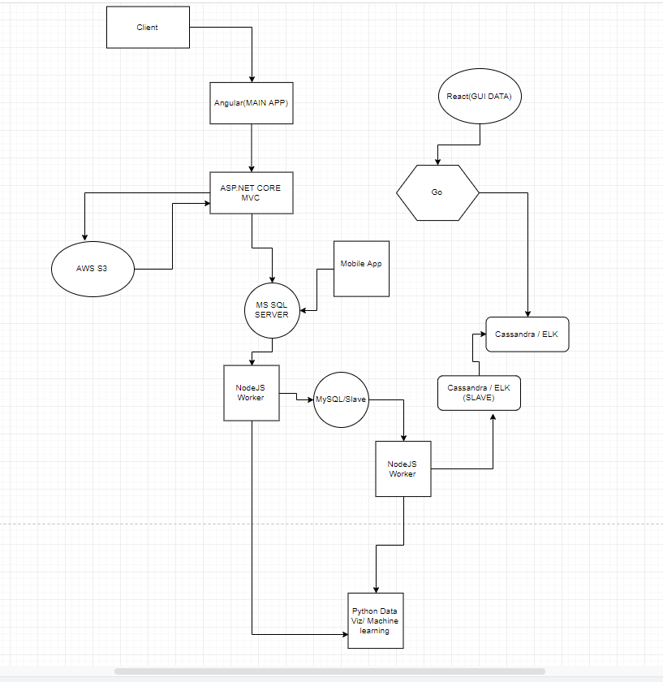

# Rules for development
    - Provide documentation using the readme.md
    - always use linting.
    - implement Object Oriented Programming.

# Code Review
    - Code review are done before merging.
    - do a brief presentation on what you did and why you did it onsight.
    - requires two approvers before merging.

# Code bugs
    - make an issue on github
    - make a stackoverflow post and link it along with the issue
    - ask during meetups

# Project Structure

 - to modify the structure download the [architecture.drawio](architecture.drawio) then open it using draw.io